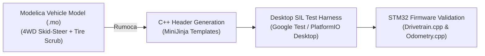

# Rover Simulation and Software-in-the-Loop (SIL) Workflow

This document outlines the simulation, kinematic modeling, and Software-in-the-Loop (SIL) verification workflow for **ggRover** (4WD Skid-Steer STM32 / Arduino platform).

---

## 1. Kinematic & Dynamic Modeling with Rumoca

Skid-steer rovers experience continuous lateral tire slip during turns. Accurate odometry and path tracking require modeling wheel friction, normal forces, and motor torque-speed curves.

### Steps:
1. **Modelica Model (`ggRover_physics.mo`):**
   - 4-wheel differential speeds $(v_L, v_R)$, track width $w$, wheel radius $r$, chassis inertia $I_z$.
   - Non-linear friction scrub coefficients $\mu_{skid}(\omega_{turn})$.
2. **Rumoca C++ Export:**
   - Compile `.mo` file with **Rumoca** to output lightweight, zero-dependency C++ structs representing vehicle state derivatives $\dot{x} = f(x, u)$.
3. **Firmware SIL Testing:**
   - Include generated C++ headers directly into PlatformIO desktop test suites (`native` environment).
   - Feed simulated IMU and wheel encoder pulses back to `Odometry.cpp` and `HeadingSystem.cpp` to verify dead-reckoning accuracy without needing physical hardware.

---

## 2. 3D Simulator Options for ggRover

| Simulator | Physics Engine | Setup Effort | Best For ggRover |
| :--- | :--- | :--- | :--- |
| **Webots** | ODE (Open Dynamics Engine) | Low (Out-of-the-box 4WD templates) | Primary desktop 3D simulator for telemetry & obstacle avoidance logic. |
| **Gazebo Harmonic** | DART / Bullet | Medium (ROS 2 / SDF model setup) | Full ROS 2 navigation stack integration (SLAM, Nav2). |
| **Project Chrono** | Chrono::Engine | High (Complex C++ API) | Terramechanics & soft soil / high-fidelity tire friction research. |

---

## 3. Recommended Roadmap Integration
- **Phase 1 (Current):** Hardware validation & basic microcontroller firmware (`rover-firmware`).
- **Phase 2 (SIL Integration):** Implement Rumoca C++ physics model export for unit testing `Odometry.h` against simulated wheel slip.
- **Phase 3 (3D Simulation):** Create a Webots SDF/URDF model of ggRover to test remote gamepad telemetry and autonomous waypoint tracking.
